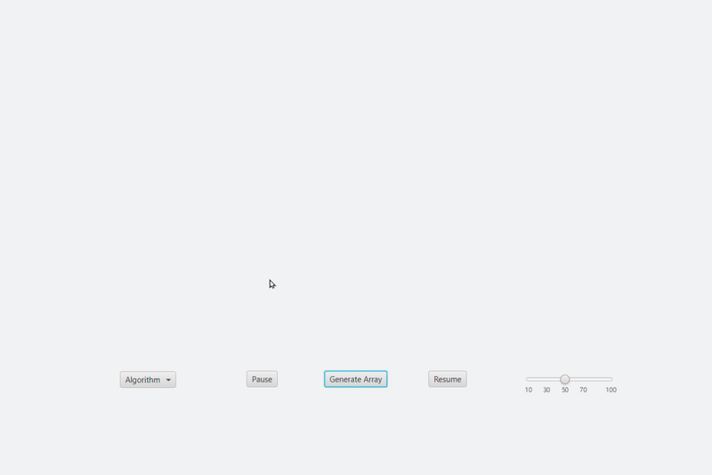
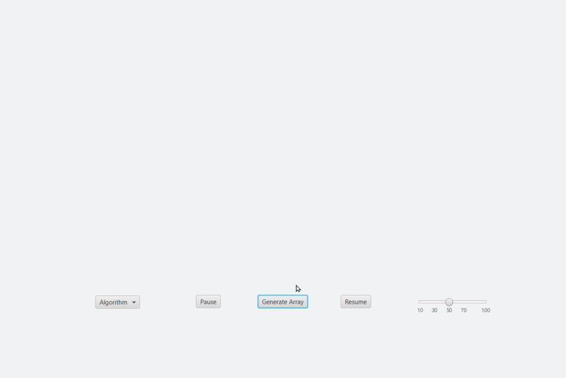

# Sorting Algorithm Visualizer

A **JavaFX-based application** that visualizes various sorting algorithms in action. I created this project to apply my knowledge of **Data Structures, Multithreading, Abstraction, and JavaFX**, which I learned in Semester 1 of my MCA. Feel free to download and explore the program.

---

## Features

- **Visualize Sorting Algorithms:**  
  Watch sorting algorithms like **Bubble Sort, Insertion Sort, and Heap Sort** in action. Gain insights into not just their time complexities (best and worst cases).

- **Customizable Array Size with Animation:**  
  Adjust the array size to see how different algorithms handle larger or smaller datasets, along with animations for array generation.

- **Interactive UI:**  
  User-friendly interface with controls to generate arrays, start sorting, and pause or resume the visualization.

- **Multiple Sorting Algorithms Supported:**  
  - **Bubble Sort**  
  - **Insertion Sort**  
  - **Quick Sort**  
  - **Heap Sort**

---

## Screenshots

  
*Example of the Sorting Visualizer in action.*

  

---

## How to Run

### Prerequisites
- **Java Development Kit (JDK)**: Ensure you have JDK 11 or later installed.
- **JavaFX**: This project uses JavaFX for the GUI. Make sure you have JavaFX set up in your development environment.

### Steps to Run
1. **Clone the Repository**:
   ```bash
   git clone https://github.com/ShaunRodriguess/sorting-visualizer.git
   cd sorting-visualizer
2.Run the Program:
Open the project in your IDE and run the VisualizerMain.java file.
## File Structure
sorting-visualizer/<br>
├── src/<br>
│   ├── main/<br>
│   │   ├── java/<br>
│   │   │   ├── com.example.sortingvisualizer/<br>
│   │   │   │   ├── VisualizerMain.java      # Entry point of the application<br>
│   │   │   │   ├── Controller.java          # Handles UI logic<br>
│   │   │   │   ├── Algo.java                # Sorting Algorithm Interface<br>
│   │   │   │   ├── Algos/                   # Sorting algorithm implementations<br>
│   │   │   │   │   ├── BubbleSort.java<br>
│   │   │   │   │   ├── InsertionSort.java<br>
│   │   │   │   │   ├── QuickSort.java<br>
│   │   │   │   │   ├── HeapSort.java<br>
│   ├── resources/<br>
│   │   ├── com.example.sortingvisualizer/<br>
│   │   │   ├── Visualizer.fxml              # FXML file for the UI layout<br>
├── README.md                                 # Project documentation<br>
├── VisualizerHeapSort.gif                    # Demo GIF for Heap Sort<br>
├── VisualizerQuickSort.gif                   # Demo GIF for Quick Sort<br>
